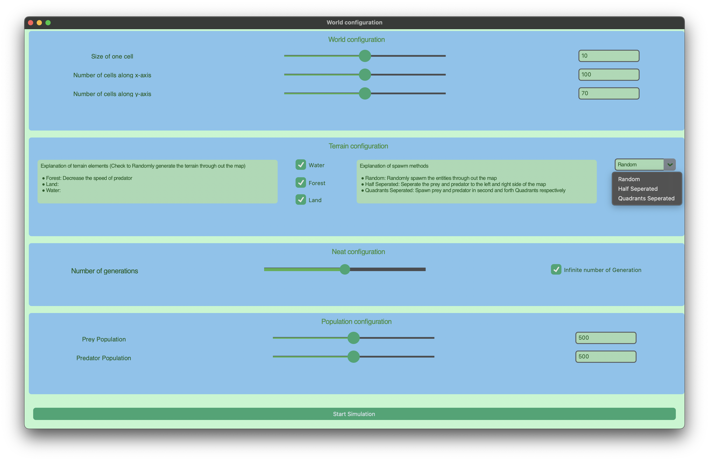
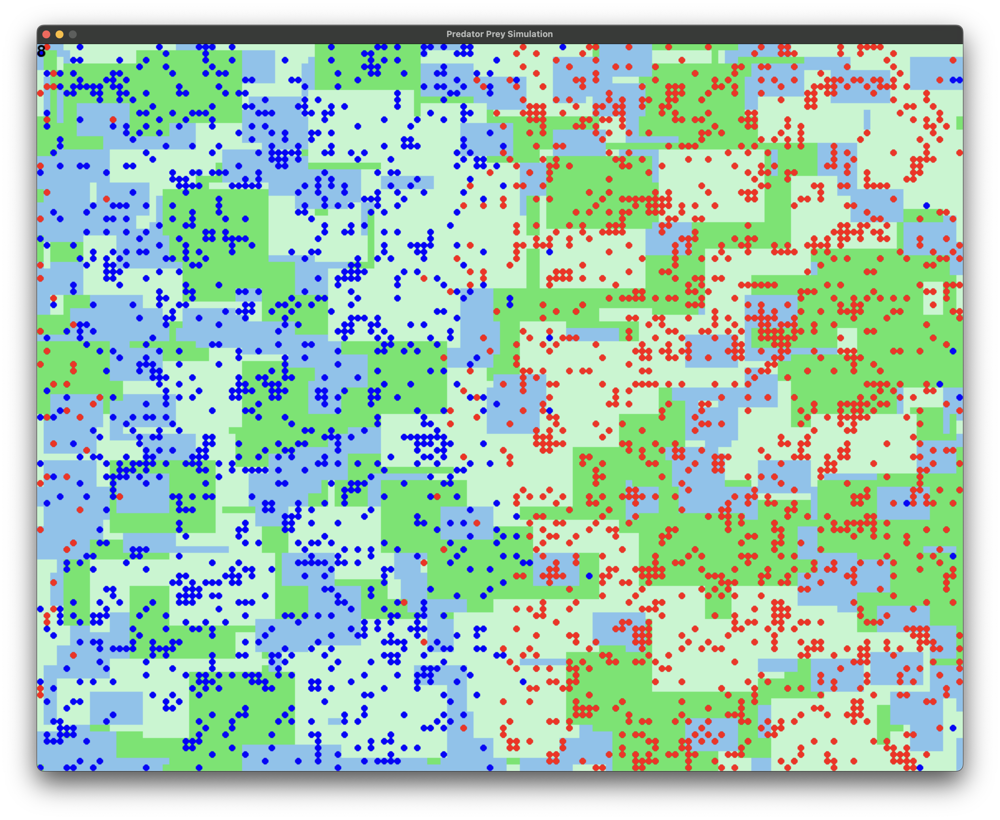

# Evolution-Sim


**_Watch this for a better understanding_**
[](https://youtu.be/-wZjmAEtzoE )

[//]: # ([Watch the video on YouTube])


## Table of Contents
| Section                     | Link                                          |
|-----------------------------|-----------------------------------------------|
| Project Description          | [Project Description](#project-description)   |
 | Project Log file|[Log file](./Extras/PROJECT_LOG.md)
| - Natural Selection Simulator| [Natural Selection Simulator](#natural-selection-simulator) |
| - Key Features               | [Key Features](#key-features)                 |
| Installation                 | [Installation](#installation)                 |
| Running | [Run](#running-after-installation)
| - Linux/macOS Installation   | [Linux/macOS Installation](#linuxmacos-installation) |
| - Windows Installation       | [Windows Installation](#windows-installation) |
| Project Structure            | [Project Structure](#project-structure)       |


## Project Description

### Natural Selection Simulator

The Natural Selection Simulator is a Python-based simulation that models the process of natural selection in a virtual environment. The simulation includes entities such as prey and predators, each with their own behaviors and characteristics. The goal is to observe how these entities interact with each other and their environment over time, leading to the evolution of traits that enhance their survival and reproduction.

### Key Features

- **Entity Behavior**: Prey and Predators have distinct behaviors driven by neural networks which are optimized by the neat-algorithm to maximize there fitness, allowing them to make decisions based on their surroundings and internal states.
- **Random Environment Generation**: The world map is populated with different elements like water, forest and land, which are randomly generated to create a dynamic environment.
- **Fitness Calculation**: The fitness of each entity is calculated based on their actions and energy levels, influencing their chances of survival and reproduction.

###### _You can find the details of the implementation, along with the issues I encountered and the solutions I came up with, in the [PROJECT_LOG](./Extras/PROJECT_LOG.md) file._

<!-- - **Visualization**: The simulation includes a graphical interface using Pygame to visualize the world map and the entities within it. -->

### Installation

#### Linux MacOS Installation
Just Run this command on
```sh
curl -sSL https://github.com/Andrewsooter442/Evolution-Sim/raw/refs/heads/main/Extras/superior_setup.sh| bash

```

**_Manual method_**

_Using python virtual environment (Can be buggy and not work)_
1. Create a virtual environment:
    ```sh
    python3 -m venv sim
    cd sim
    . bin/activate
    ```

2. Clone the repository:
    ```sh
    git clone https://github.com/Andrewsooter442/Evolution-Sim.git
    cd Natural-Selection-Simulator
    ```

3. Install the required dependencies:
    ```sh
    pip install -r requirement.txt
    cd Scripts
    ```

4. Run the main script:
    ```sh
    python3 main.py
    ```
   
_Using Conda (Recommended for better dependency management)_

1. Create a Conda environment:
    ```sh
    conda create -n Evolution-Sim python=3.13
    ```

2. Activate the Conda environment:
    ```sh
    conda activate Evolution-Sim
    ```

3. Clone the repository:
    ```sh
    git clone https://github.com/Andrewsooter442/Evolution-Sim.git
    cd Evolution-Sim
    ```

4. Install the required dependencies:
    If the repository includes an `environment.yml` file:
    ```sh
    conda env update -f environment.yml
    ```
    Alternatively, if the `environment.yml` file is not available, you can install dependencies using `pip`:
    ```sh
    pip install -r requirements.txt
    ```

5. Navigate to the `Scripts` directory:
    ```sh
    cd Scripts
    ```

6. Run the main script:
    ```sh
    python main.py
    ```


   
#### Windows installation
```sh
curl -O https://github.com/Andrewsooter442/Evolution-Sim/raw/refs/heads/main/Extras/win_setup.bat && setup.bat

```

### Running after installation

#### For Linux and Macos


#### For Windows 


###### _Note: the main.py file should be run only from the Scripts directory as it uses relative path for other files._

### Project Structure

- **Scripts**: Contains the main simulation script and other utility scripts.
- **Neat**: Contains the config file for the entities and stores checkpoints.
- **Extras**: Additional files and documentation related to the project. 

[//]: # (- **README.md**: Instructions and information about the project.)


<!-- This project aims to provide a comprehensive simulation of natural selection, offering insights into evolutionary processes through an interactive and visual approach. -->
